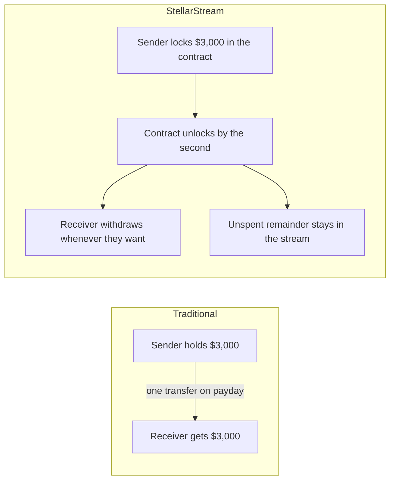
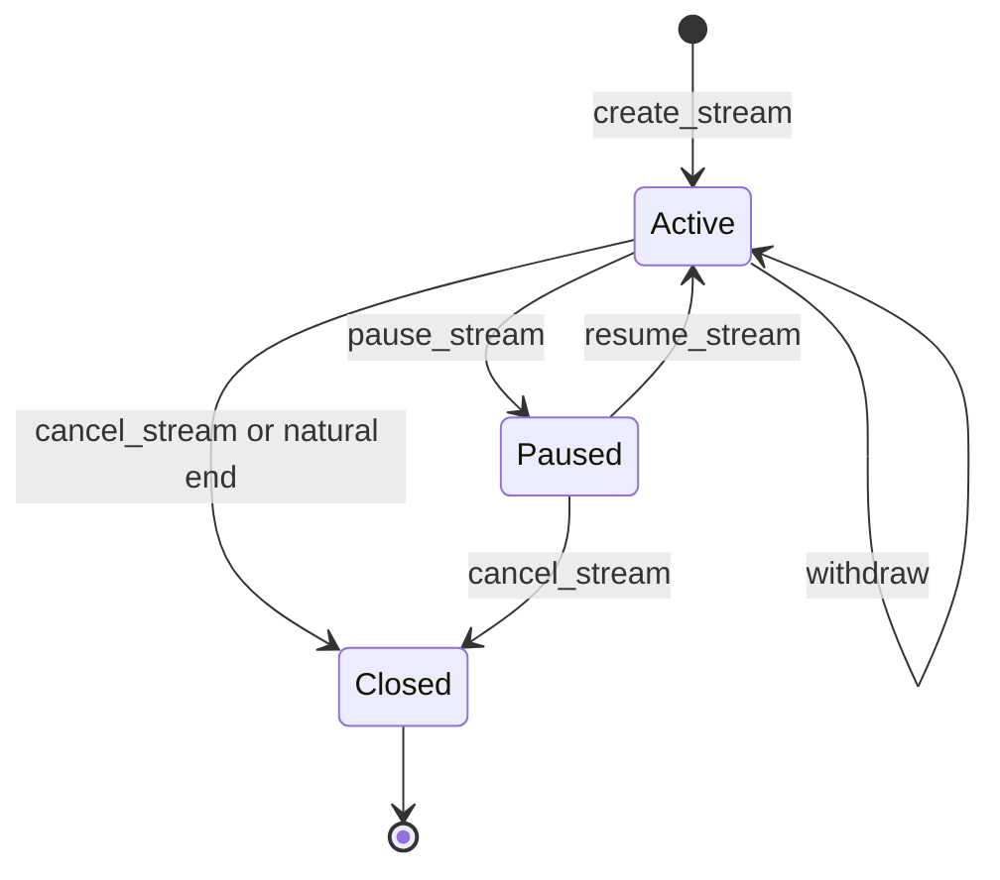
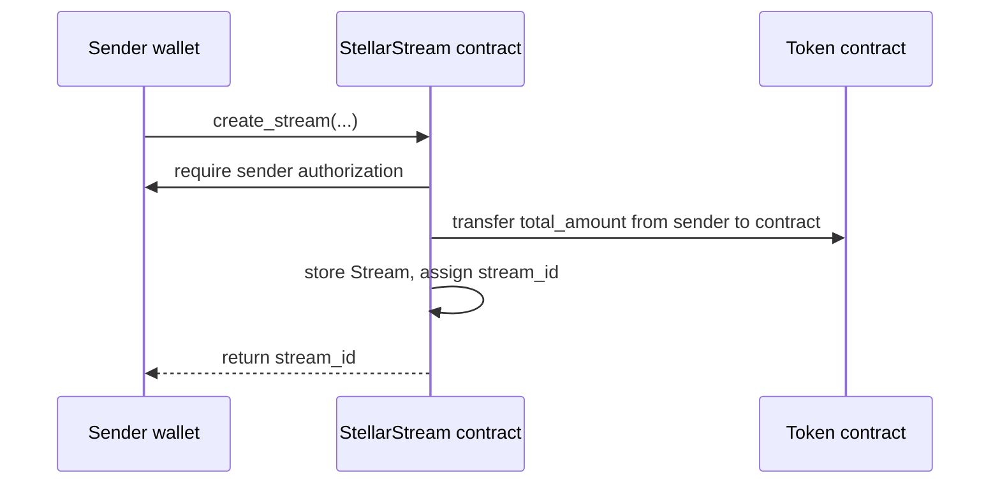
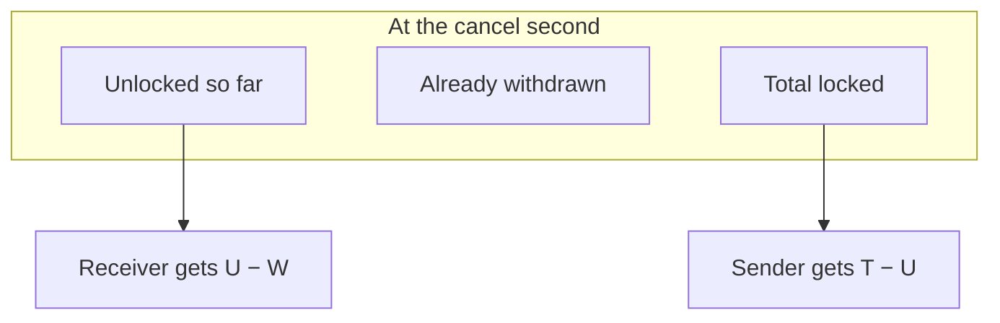
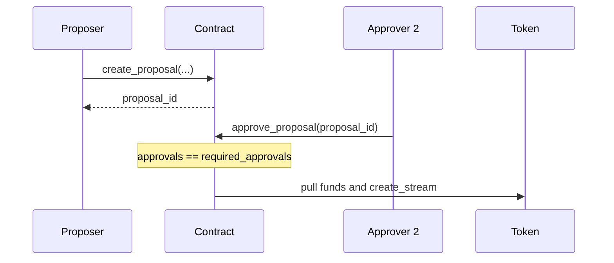
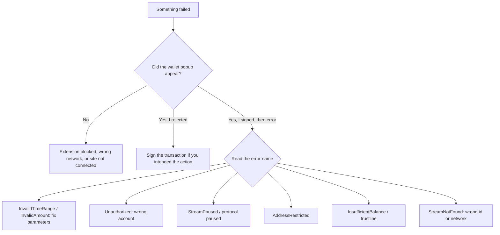

# StellarStream User Guide

**Real-time streaming payments on Stellar (Soroban)**

Version: Contract V1 · Audience: senders, receivers, operators, and developers new to Soroban

This guide explains how to **use** StellarStream: create streams, withdraw unlocked funds, cancel or pause a stream, and apply the protocol to payroll, vesting, subscriptions, and grants. It focuses on practical usage, not contract internals.

If you need function signatures, error codes, and storage details, see the [API Reference](../README.md#api-reference) in the Contract V1 README.

---

## How to use this guide

| If you are… | Start here |
|---|---|
| New to streaming payments | [1. Overview of streaming payments](#1-overview-of-streaming-payments) |
| Setting up a wallet for the first time | [2. Before you start](#2-before-you-start) |
| Paying someone over time | [3. Creating streams](#3-creating-streams) |
| Receiving a stream | [4. Withdrawing funds](#4-withdrawing-funds) |
| Stopping a payment early | [5. Cancelling streams](#5-cancelling-streams) |
| Temporarily freezing a payment | [6. Pausing and resuming](#6-pausing-and-resuming) |
| Using cliffs, curves, multi-sig, or yield | [7. Advanced features](#7-advanced-features) |
| Mapping a real business case | [8. Common scenarios](#8-common-scenarios) |
| Stuck on an error | [9. Troubleshooting](#9-troubleshooting) |
| Want a short checklist | [10. Best practices](#10-best-practices) |
| Want a full testnet dry run | [11. Your first stream in 20 minutes](#11-your-first-stream-in-20-minutes) |
| Need to inspect a stream | [12. Reading streams and monitoring activity](#12-reading-streams-and-monitoring-activity) |
| Have a specific question | [13. Frequently asked questions](#13-frequently-asked-questions) |

Non-technical sections lead with plain language. Each operational chapter then adds **dashboard steps**, **Stellar CLI examples**, and **TypeScript examples** so developers new to Soroban can follow the same flow on-chain.

---

## Table of contents

1. [Overview of streaming payments](#1-overview-of-streaming-payments)
2. [Before you start](#2-before-you-start)
3. [Creating streams](#3-creating-streams)
4. [Withdrawing funds](#4-withdrawing-funds)
5. [Cancelling streams](#5-cancelling-streams)
6. [Pausing and resuming](#6-pausing-and-resuming)
7. [Advanced features](#7-advanced-features)
8. [Common scenarios](#8-common-scenarios)
9. [Troubleshooting](#9-troubleshooting)
10. [Best practices](#10-best-practices)
11. [Your first stream in 20 minutes](#11-your-first-stream-in-20-minutes)
12. [Reading streams and monitoring activity](#12-reading-streams-and-monitoring-activity)
13. [Frequently asked questions](#13-frequently-asked-questions)
14. [Appendix A — Glossary](#appendix-a--glossary)
15. [Appendix B — Error catalog](#appendix-b--error-catalog)
16. [Appendix C — CLI cheat sheet](#appendix-c--cli-cheat-sheet)
17. [Appendix D — Worked math examples](#appendix-d--worked-math-examples)
18. [Appendix E — Checklists](#appendix-e--checklists)
19. [Appendix F — Further reading](#appendix-f--further-reading)
20. [Appendix G — API methods in plain language](#appendix-g--api-methods-in-plain-language)

---

## 1. Overview of streaming payments

### 1.1 The idea in one sentence

A **stream** is a payment that unlocks continuously over time instead of arriving as one lump sum.

Think of a tap, not a paycheck. Once the tap is open, value drips from the sender into the receiver’s withdrawable balance as Stellar ledgers close (roughly every five seconds). The receiver can withdraw what has already unlocked at any moment. The sender never has to trust the receiver with the full amount up front, and the receiver never has to wait until the end of the month to access earned funds.

### 1.2 Traditional payment vs streaming payment

```text
Traditional payroll (lump sum)
|---------------- $3,000 on the 30th ----------------|
 Day 1                                          Day 30
 Work happens now. Money arrives later.

Streaming payroll (StellarStream)
|[ $4.63 ][ $4.63 ][ $4.63 ] ... every hour ... |
 Day 1                                          Day 30
 Work happens now. Money unlocks now.
```



### 1.3 Why this exists

Traditional systems (payroll, subscriptions, token vesting, retainers) all share the same shape: **wait, then pay a lump**. That creates four recurring problems:

| Problem | What StellarStream does instead |
|---|---|
| Receivers wait weeks for work already done | Funds unlock continuously and can be withdrawn at any time |
| Senders must fully trust receivers (or vice versa) with a large transfer | The contract holds the funds and enforces the schedule. Neither party can take more than they are entitled to |
| Cancelling mid-cycle means overpaying or clawing money back | Cancellation splits the remaining balance **pro-rata to the second** |
| Cross-border payouts are slow and expensive | Settlement is on Stellar, designed for fast, low-cost transfers, including stablecoins |

### 1.4 Who the protocol is for

- **Senders** — companies, DAOs, grantmakers, and individuals who want money to flow on a schedule.
- **Receivers** — employees, contractors, token recipients, and subscribers who want access to earned funds without waiting for a payday.
- **Operators** — admins, pausers, and treasury managers who keep the protocol compliant and available.
- **Builders** — developers integrating the contract from a dashboard, script, or another Soroban contract.

You do **not** need to write Rust to use StellarStream. You need a Stellar wallet, a supported token, and (optionally) the dashboard or CLI.

### 1.5 What a stream is made of

Every stream has a small set of fields. You set most of them at creation; the contract updates the rest as time passes.

| Field | Plain meaning |
|---|---|
| **Sender** | The account that funded the stream |
| **Receiver** | The account that can withdraw unlocked tokens |
| **Token** | The asset being streamed (for example USDC) |
| **Total amount** | The full sum locked at creation |
| **Start time** | When unlocking begins |
| **End time** | When unlocking finishes (100% vested) |
| **Withdrawn amount** | How much the receiver has already claimed |
| **State** | `Active`, `Paused`, or `Closed` |
| **Curve** | How fast tokens unlock (`Linear` or `Exponential`) |
| **Soulbound** | If true, the stream cannot be transferred to another receiver |

The contract does not run a background timer. When someone calls `withdraw`, `get_unlocked_amount`, or `cancel_stream`, the contract **reads the current ledger timestamp** and does the math. That is why streams stay cheap and trustless: there is no keeper bot and no off-chain scheduler.

### 1.6 The unlock formula (plain language)

For a **linear** stream with no cliff and no pauses:

> Unlocked = Total amount × (time already passed ÷ total duration)

If a 30-day stream of 10,000 USDC is 10 days in, one third of the time has passed, so about 3,333 USDC is unlocked. If the receiver already withdrew 1,000 USDC, they can withdraw about 2,333 more.

The protocol always **rounds down**. Leftover fractions stay in the stream until a later withdrawal (or the final withdrawal, which pays the exact remaining balance). This protects the contract from paying out more than it holds.

See [Appendix D](#appendix-d--worked-math-examples) for fully worked numbers, including exponential curves, cliffs, and pauses.

### 1.7 Stream lifecycle



What each state means for users:

- **Active** — tokens unlock according to the schedule. The receiver can withdraw. The sender can pause or cancel (unless the stream is configured otherwise).
- **Paused** — unlocking is frozen. Already-unlocked funds typically remain withdrawable depending on the operation; new unlocks do not accrue until resume. Time spent paused does not count as vesting time.
- **Closed** — the stream is finished or cancelled. No further unlocking. Remaining unearned funds have been returned to the sender (on cancel) or fully claimed by the receiver (on natural completion).

### 1.8 Custody: who holds the money?

StellarStream is **non-custodial**. When you create a stream:

1. You approve the contract to pull the token amount.
2. The tokens move from your wallet into the contract.
3. The contract is the only party that can release them, and only according to the rules of that stream.

The StellarStream team, the dashboard, and the indexer **cannot** move those tokens. If the dashboard is down, you can still withdraw or cancel by calling the contract directly with the [Stellar CLI](https://developers.stellar.org/docs/tools/cli/stellar-cli) or a wallet that supports Soroban.

### 1.9 Networks

| Network | When to use it |
|---|---|
| **Testnet / Futurenet** | Learning, integration, and dry runs. Tokens have no real value. |
| **Mainnet (Public)** | Real payments. Double-check addresses, amounts, and start/end times. |

This guide uses **testnet** in all command examples. Replace the network flag and contract id when you move to production.

---

## 2. Before you start

### 2.1 What you need

1. A **Stellar account** with a small XLM balance for fees (even token streams pay fees in XLM).
2. A **wallet** that can sign Soroban transactions. [Freighter](https://www.freighter.app/) is the wallet the dashboard is built around. Hardware wallets are supported in some dashboard flows.
3. The **token** you want to stream (sender) or receive (receiver). Most users start with a stablecoin such as USDC.
4. A **trustline** for that token on both the sender and the receiver accounts (classic Stellar requirement for non-XLM assets).
5. Optional: the **Stellar CLI** if you prefer the terminal over the dashboard.

You do not need to compile the contract to use a deployed instance.

### 2.2 Install a wallet (non-technical)

**Dashboard path**

1. Install the [Freighter browser extension](https://www.freighter.app/).
2. Create or import a Stellar account.
3. In Freighter, select **Test Network** while you learn.
4. Fund the account with test XLM from the [Friendbot](https://developers.stellar.org/docs/learn/fundamentals/networks#friendbot) (testnet only).
5. Open the StellarStream dashboard and click **Connect wallet**.
6. Approve the connection in Freighter.

**What “connect” actually does**

Connecting does **not** give the dashboard custody of your funds. It lets the site *propose* transactions. Every create, withdraw, cancel, pause, and resume still requires you to **sign** in the wallet.

### 2.3 Install the Stellar CLI (for developers new to Soroban)

```bash
# Install the CLI (see official docs for the current package name)
cargo install --locked stellar-cli

# Confirm it works
stellar --version

# Add a testnet identity named alice
stellar keys generate alice --network testnet --fund

# See the public address
stellar keys address alice
```

Configure the network once:

```bash
stellar network add testnet \
  --rpc-url https://soroban-testnet.stellar.org \
  --network-passphrase "Test SDF Network ; September 2015"
```

Official references:

- [Stellar CLI manual](https://developers.stellar.org/docs/tools/cli/stellar-cli)
- [Contract invoke argument types](https://developers.stellar.org/docs/tools/cli/cookbook/contract-invoke-arguments)
- [Soroban getting started](https://developers.stellar.org/docs/build/smart-contracts/getting-started)

### 2.4 Tokens, trustlines, and amounts

Stellar amounts are integers. USDC and most Stellar assets use **7 decimal places**. The smallest unit is often called a **stroop** (for XLM) or the token’s minimum increment.

| What you see | What the contract stores |
|---|---|
| `100.0000000` USDC | `1000000000` (100 × 10⁷) |
| `1.5` USDC | `15000000` |
| `0.0000001` USDC | `1` |

When you use the dashboard, you type human amounts (`1000`). When you use the CLI or SDK, you almost always pass the **integer** amount.

**Trustlines (receivers, please read this)**

If the receiver does not have a trustline for the token, withdrawals can fail even though the stream is valid. Before creating a stream:

1. Confirm the receiver account exists (it has been funded with XLM).
2. Confirm the receiver has a trustline for the token, with enough unused limit.
3. The dashboard flags missing trustlines during create-stream; do not ignore that warning.

### 2.5 Find the contract id

The protocol is a deployed Soroban contract. You need its **contract id** (a `C…` address) to call it from the CLI.

```bash
# Discover the functions on a deployed contract
stellar contract invoke \
  --id CEXAMPLECONTRACTID000000000000000000000000000000 \
  --source alice \
  --network testnet \
  -- \
  --help
```

Keep a local note of:

- Contract id
- Token contract id (the SAC / SEP-41 token you will stream)
- Your sender and receiver addresses

### 2.6 Roles at a glance

Most users are just **sender** or **receiver**. Protocol operators have extra roles. Full permission tables live in the [API Reference — administrative functions](../README.md#administrative-functions).

| Role | Everyday meaning |
|---|---|
| **Sender** | Created and funded a stream. Can pause, resume, and usually cancel that stream |
| **Receiver** | Can withdraw unlocked tokens from that stream |
| **Admin** | Grants/revokes roles, upgrades, compliance actions |
| **Pauser** | Can pause the **entire protocol** in an emergency (not a single stream) |
| **TreasuryManager** | Updates protocol fees and treasury address |

Do not confuse **pausing a stream** (sender action) with **pausing the contract** (operator emergency stop).

### 2.7 Fees you will see

You may pay two kinds of fees:

1. **Network fees** — Stellar inclusion + Soroban resource fees, paid in XLM by the account that signs the transaction.
2. **Protocol fees** — if configured, a small bps fee on stream creation or other operations, sent to the protocol treasury.

The dashboard shows a fee breakdown before you sign. Always read it. If your XLM balance is too low, the transaction will fail even when you have plenty of the streamed token.

---

## 3. Creating streams

Creating a stream locks tokens in the contract and starts (or schedules) a continuous unlock toward a receiver.

### 3.1 What you decide at creation

| Decision | Typical choice | Notes |
|---|---|---|
| Receiver address | The person or company you are paying | Double-check. Streams pay the address you type, not a name |
| Token | USDC or another SEP-41 token | Both parties need a trustline |
| Total amount | Salary, invoice, grant, or vest | Entire amount is locked up front |
| Start time | “Now” or a future date | Future starts vest nothing until that time |
| End time | Duration (30 days, 1 year, …) | Must be after start time |
| Curve | Linear (default) | Exponential back-loads the unlock |
| Soulbound | Off, unless identity-locked | Cannot be changed later |
| Cliff | Optional | Nothing unlocks before the cliff |

Once created, **sender, receiver, token, total amount, curve, and soulbound flag** are part of the stream’s identity. You manage the stream by withdrawing, pausing, resuming, cancelling, or (in the dashboard) topping up — you do not “edit” those identity fields.

### 3.2 Linear vs exponential (choose before you sign)

**Linear (recommended for payroll, retainers, and subscriptions)**

Unlock is proportional to time. Half the time → half the money.

**Exponential (optional, for delayed-reward vesting)**

Unlock accelerates. Early days unlock little; later days unlock more. Same 1,000 token / 100 day stream:

| Day | Linear unlocked | Exponential unlocked |
|---|---|---|
| 25 | 250 | 62.50 |
| 50 | 500 | 250 |
| 75 | 750 | 562.50 |
| 100 | 1,000 | 1,000 |

If you are paying wages, use **linear**. Exponential is for cases where you intentionally want the receiver to wait for most of the value.

### 3.3 Dashboard: create a stream step by step

These steps match the create-stream flow in the StellarStream dashboard.

1. Connect Freighter and confirm you are on the intended network.
2. Open **Dashboard → Create stream**.
3. Choose the **asset** (for example USDC).
4. Paste the **recipient Stellar address**. Add an optional label for your own records (labels are not stored on-chain).
5. If the UI warns about a missing trustline or unfunded account, **stop and fix that first**.
6. Enter the **total amount**.
7. Choose a duration preset (1 day, 1 week, 1 month, 3 months, 1 year) or a custom end date.
8. Review the implied **rate** (per second / hour / day). If the rate looks wrong, your duration or amount is wrong.
9. Optional: enable split recipients, privacy shield, or other dashboard extras. See [7. Advanced features](#7-advanced-features).
10. Review the simulation / fee breakdown.
11. Click **Create**, then **sign in Freighter**.
12. Wait for confirmation. Save the **stream id** from the success screen or the stream detail page.

**Worked dashboard example — contractor retainer**

- Receiver: `GCONTRACTOR…` (the freelancer)
- Token: USDC
- Amount: `3,000`
- Duration: 1 month
- Curve: Linear
- Start: immediately

After signing, 3,000 USDC leaves the sender wallet and sits in the contract. Roughly `3,000 / 30 = 100` USDC unlocks per day (actual rate is per second over the exact duration).

### 3.4 CLI: create a stream

Replace placeholders before running. Amounts are integers with 7 decimals (`3000` USDC → `30000000000`).

```bash
# Unix timestamps (seconds)
START=$(date -u +%s)
END=$((START + 2592000))   # 30 days

stellar contract invoke \
  --id CEXAMPLECONTRACTID000000000000000000000000000000 \
  --source alice \
  --network testnet \
  -- \
  create_stream \
  --sender $(stellar keys address alice) \
  --receiver GCONTRACTOREXAMPLEADDRESS0000000000000000000000 \
  --token CEXAMPLETOKENCONTRACT0000000000000000000000000 \
  --total_amount 30000000000 \
  --start_time $START \
  --end_time $END \
  --curve_type Linear \
  --is_soulbound false
```

A successful call returns a **stream id** (`u64`), for example `42`. Store it. Almost every later action needs it.

On Windows PowerShell, compute timestamps with:

```powershell
$start = [int][double]::Parse((Get-Date -UFormat %s))
$end   = $start + 2592000
```

Then pass `--start_time $start --end_time $end`.

### 3.5 TypeScript: create a stream

The dashboard talks to the contract through typed bindings in `frontend/lib/contracts/stellarstream.ts`. A typical app call looks like this:

```typescript
import type {
  CreateStreamParams,
  StellarStreamContractClient,
} from "@/lib/contracts/stellarstream"

const params: CreateStreamParams = {
  sender: senderAddress,
  receiver: receiverAddress,
  token: usdcContractId,
  totalAmount: 3_000n * 10_000_000n, // 3000 USDC, 7 decimals
  startTime: BigInt(Math.floor(Date.now() / 1000)),
  endTime: BigInt(Math.floor(Date.now() / 1000) + 30 * 24 * 60 * 60),
  curveType: "Linear",
}

const streamId: bigint = await contract.createStream(params)
console.log("Created stream", streamId.toString())
```

The wallet must sign the transaction. Never embed secret keys in frontend code.

### 3.6 What happens on-chain when creation succeeds



After this:

- The sender’s token balance is reduced by `total_amount` (plus any protocol fee).
- The receiver does **not** yet have the tokens in their wallet.
- The receiver’s **withdrawable** balance starts at `0` (or stays `0` until `start_time`).
- Anyone can look up the stream with `get_stream`.

### 3.7 Validation the contract enforces

Creation is rejected when:

| Condition | Typical error |
|---|---|
| `start_time >= end_time` | `InvalidTimeRange` |
| `total_amount <= 0` | `InvalidAmount` |
| Receiver (or sender) is on the restricted list | `AddressRestricted` |
| Sender did not sign / is not authorized | `Unauthorized` |
| Sender token balance is too low | `InsufficientBalance` |
| Cliff is not inside `[start_time, end_time]` | `InvalidTimeRange` / cliff error |
| Contract is globally paused | protocol paused error |

Full list: [Appendix B](#appendix-b--error-catalog) and the [API error types](../README.md#error-types).

### 3.8 Creating several streams at once

If you run payroll for a team, prefer **batch creation** (one transaction, many streams) when the contract and dashboard offer it. It saves fees compared with signing 40 separate transactions.

Dashboard path: use the splitter / bulk recipient tools when paying many addresses from one budget. Confirm each address and each share **before** you sign. A wrong address in a batch is still a real payment.

CLI path (conceptually):

```bash
stellar contract invoke \
  --id CEXAMPLECONTRACTID000000000000000000000000000000 \
  --source alice \
  --network testnet \
  -- \
  create_streams_batch \
  --streams-file-path ./payroll-april.json
```

Exact batch method names may vary by deployment. Inspect the contract with `-- --help` and read [Stream management in the API](../README.md#stream-management).

### 3.9 Future-dated streams

You can set `start_time` in the future (for example, “vesting begins on 1 September”). Until then:

- `get_unlocked_amount` returns `0`
- `withdraw` should fail or pay `0`
- The tokens are already locked, so the sender cannot spend them elsewhere

This is the usual pattern for **token TGE vesting** that must not start before a public date.

### 3.10 After creation: where to find the stream

- **Dashboard:** it appears in the sender’s outgoing list and the receiver’s incoming list.
- **CLI:** `get_user_streams` for an address, or `get_stream` if you already have the id.
- **Public page:** `/stream/{id}` on the frontend, useful for sharing a read-only view.

```bash
stellar contract invoke \
  --id CEXAMPLECONTRACTID000000000000000000000000000000 \
  --network testnet \
  --send=no \
  -- \
  get_user_streams \
  --user $(stellar keys address alice)
```

`--send=no` simulates a read (no signature, no fee) when the method is a view.

---

## 4. Withdrawing funds

Withdrawal is how a **receiver** turns unlocked value into tokens in their wallet.

### 4.1 What “unlocked” vs “withdrawable” means

- **Unlocked** — how much of the total has vested by the current ledger time (minus paused time, after cliff rules).
- **Already withdrawn** — how much the receiver has claimed so far.
- **Withdrawable** — `unlocked − already withdrawn`. This is the number you can actually pull.

```text
Total        ████████████████████  3,000
Unlocked     ████████░░░░░░░░░░░░  1,200   (40% of time elapsed)
Withdrawn    ████░░░░░░░░░░░░░░░░    600   (previous claims)
Withdrawable ████░░░░░░░░░░░░░░░░    600   (1,200 − 600)
Still locked ░░░░░░░░░░░░░░░░░░░░  1,800
```

You can withdraw as often as you like. Each withdrawal only pays the newly unlocked remainder. Frequent withdrawals cost extra network fees; they do not change how fast tokens unlock.

### 4.2 Dashboard: withdraw step by step

1. Connect the **receiver** wallet (the sender cannot withdraw the receiver’s funds).
2. Open the stream from **Incoming streams** or `/stream/{id}`.
3. Confirm status is **Active** (or, if paused, that a withdrawable remainder still exists).
4. Read the live / ticking **available** amount.
5. Click **Withdraw**.
6. Confirm the amount and the estimated fee.
7. Sign in Freighter.
8. Wait for confirmation. Your token wallet balance should increase by the withdrawn amount.

If **Withdraw** is disabled:

- The stream has not started yet.
- Nothing new has unlocked since the last withdrawal.
- The stream is paused and the contract forbids withdrawal while paused (`StreamPaused`).
- The protocol is in emergency pause.
- You are not the receiver.

### 4.3 CLI: check then withdraw

Always **read** before you write:

```bash
# Full stream record
stellar contract invoke \
  --id CEXAMPLECONTRACTID000000000000000000000000000000 \
  --network testnet \
  --send=no \
  -- \
  get_stream \
  --stream_id 42

# Currently unlocked (gross)
stellar contract invoke \
  --id CEXAMPLECONTRACTID000000000000000000000000000000 \
  --network testnet \
  --send=no \
  -- \
  get_unlocked_amount \
  --stream_id 42

# What you can actually claim
stellar contract invoke \
  --id CEXAMPLECONTRACTID000000000000000000000000000000 \
  --network testnet \
  --send=no \
  -- \
  get_withdrawable_amount \
  --stream_id 42
```

Then withdraw as the receiver:

```bash
stellar contract invoke \
  --id CEXAMPLECONTRACTID000000000000000000000000000000 \
  --source bob \
  --network testnet \
  -- \
  withdraw \
  --stream_id 42 \
  --receiver $(stellar keys address bob)
```

The call returns the **amount paid** (`i128`). If it returns `0`, nothing was withdrawable at that ledger.

Some deployments accept an explicit `--amount`. Never request more than `get_withdrawable_amount`; the contract will reject it (`InsufficientBalance` or an amount error).

### 4.4 TypeScript: withdraw

```typescript
const withdrawable = await contract.getWithdrawable(42n)

if (withdrawable <= 0n) {
  throw new Error("Nothing to withdraw yet")
}

await contract.withdraw({
  streamId: 42n,
  amount: withdrawable, // or a smaller partial amount if supported
})
```

### 4.5 Partial withdrawals

You do not have to take everything that is unlocked. A contractor might withdraw once a week to cover expenses and leave the rest accruing.

Rules of thumb:

- Partial withdrawals do not pause or extend the stream.
- The contract remembers `withdrawn_amount` so you cannot double-claim.
- The **last** withdrawal of a completed stream should empty the remainder exactly (the math engine pays the remaining balance to avoid dust locked forever).

### 4.6 Worked example — weekly contractor withdrawals

Setup: 3,000 USDC over 30 days, linear, started 1 April 00:00 UTC.

| Date | Elapsed | Unlocked (approx.) | Action | Wallet receives | Withdrawn so far |
|---|---|---|---|---|---|
| 1 Apr | 0 | 0 | — | 0 | 0 |
| 8 Apr | 7 days | 700 | Withdraw all | 700 | 700 |
| 15 Apr | 14 days | 1,400 | Withdraw all | 700 | 1,400 |
| 22 Apr | 21 days | 2,100 | Skip | 0 | 1,400 |
| 29 Apr | 28 days | 2,800 | Withdraw all | 1,400 | 2,800 |
| 1 May | 30 days | 3,000 | Final withdraw | 200 | 3,000 |

Skipping a week does **not** forfeit tokens. They stay unlocked and wait.

### 4.7 Who can withdraw?

Only the **receiver** (or an authorized caller acting as the receiver) can withdraw. The sender cannot pull unlocked funds back by calling `withdraw`. To recover unearned funds, the sender **cancels** (see next chapter).

Soulbound streams still allow the original receiver to withdraw; they just cannot assign the stream to someone else.

### 4.8 Withdrawal while paused or after cancel

| Stream state | Can the receiver withdraw? |
|---|---|
| Active, before start | No (nothing unlocked) |
| Active, in progress | Yes, unlocked − withdrawn |
| Active, past end | Yes, remaining unclaimed total |
| Paused | Often **no** (`StreamPaused`); already unlocked funds may require resume or a dedicated path — check the deployment |
| Closed (cancelled) | Unearned returned to sender; earned should have been paid to the receiver during cancel |
| Protocol emergency pause | Usually no user withdrawals until operators unpause |

If cancel already settled the receiver, a later `withdraw` should fail with `AlreadyCancelled` / stream closed.

---

## 5. Cancelling streams

Cancel **ends** a stream immediately and settles both sides in one transaction.

### 5.1 What cancel does (the important mental model)

At the exact ledger timestamp of the cancel transaction:

1. The contract computes how much has **earned** (unlocked).
2. That earned remainder (unlocked minus already withdrawn) is sent to the **receiver**.
3. Everything still **unearned** is returned to the **sender**.
4. The stream state becomes `Closed`.
5. The action cannot be undone.



There is no negotiation about “how much was owed.” The formula is the same one used for withdrawals.

### 5.2 When you should cancel vs pause

| Situation | Prefer |
|---|---|
| Contractor engagement ended | **Cancel** |
| Employee leaving the company | **Cancel** |
| Temporary project hold, same people, same terms | **Pause** |
| Suspected compromised receiver account | **Pause** first, then cancel after you confirm |
| Stream should never resume | **Cancel** |
| You only want to stop *new* unlocking for a weekend | **Pause** |

Pause is a freeze. Cancel is a final settlement.

### 5.3 Dashboard: cancel step by step

1. Connect as the **sender** (or the party allowed to cancel that stream).
2. Open the stream detail page.
3. Click **Cancel**.
4. Read the confirmation: it should show estimated **receiver payout** and **sender refund**.
5. Understand that this is irreversible.
6. Sign the transaction.
7. Confirm both balances: receiver received earned tokens; sender received the rest.

The dashboard marks cancel as a **danger** action for a reason. A mistaken cancel on a one-year vest cannot be reversed; you would have to create a new stream.

### 5.4 CLI: cancel

```bash
stellar contract invoke \
  --id CEXAMPLECONTRACTID000000000000000000000000000000 \
  --source alice \
  --network testnet \
  -- \
  cancel_stream \
  --stream_id 42 \
  --sender $(stellar keys address alice)
```

See [cancel_stream in the API](../README.md#stream-management).

### 5.5 TypeScript: cancel

```typescript
await contract.cancelStream({ streamId: 42n })
```

Only the authorized party should be able to sign this. If a random account calls it, expect `Unauthorized`.

### 5.6 Worked example — cancel on day 10 of 30

- Total: 3,000 USDC
- Duration: 30 days linear
- Already withdrawn by receiver: 400 USDC
- Cancel at day 10 (one third elapsed)

Unlocked = `3000 × 10/30 = 1,000`  
Receiver gets now = `1,000 − 400 = 600`  
Sender refund = `3,000 − 1,000 = 2,000`

After cancel:

- Receiver has received `400 + 600 = 1,000` in total (exactly their earned share).
- Sender has `2,000` back in their wallet.
- Stream is `Closed`.

### 5.7 Who is allowed to cancel?

The V1 API documents `cancel_stream` as a **sender** action. Some product configurations may also allow the receiver to cancel (they would still only receive earned funds; they cannot take the unearned remainder).

Always check the stream’s rules in the dashboard or via `get_stream` before you assume the receiver can cancel.

Soulbound streams can still be cancelled by the sender; soulbound only blocks **transfer of the receiver identity**, not settlement.

### 5.8 Cancel after the stream has fully vested

If `now >= end_time` and the receiver has not withdrawn everything, cancel (or a final withdraw) should send the remaining unlocked amount to the receiver and refund **0** to the sender. Cancelling a fully vested stream is just another way to finish settlement.

### 5.9 Common cancel mistakes

- **Cancelling the wrong stream id.** Always open the detail page and check receiver, amount, and token.
- **Expecting pause behavior.** Cancel will not let you resume later.
- **Forgetting the receiver payout.** Cancel is not “return 100% to sender.” Earned funds still go to the receiver.
- **Cancelling while thinking in calendar months.** The contract uses exact timestamps, not “April has 30 days in the spreadsheet.”

---

## 6. Pausing and resuming

Pause **stops time** for vesting. Resume starts it again, without paying anyone extra and without shortening the remaining work unless you intend that.

### 6.1 What pause actually freezes

While a stream is `Paused`:

- New tokens **stop unlocking**.
- The clock for “elapsed vesting time” ignores the paused interval.
- The stream is not closed; funds stay in the contract.
- Cancel is still possible.
- Withdrawals may be blocked (`StreamPaused`) until you resume — treat that as the safe default.

```text
Active    [======== unlocking ========]
Pause     [          frozen          ]
Resume    [======== unlocking ========]

Vesting time counted: only the = segments
Paused duration is subtracted from elapsed time
```

Effective elapsed time:

```text
effective_elapsed = now − start_time − total_paused_duration
```

See [Pause/Resume Mechanism](../README.md#5-pauseresume-mechanism) in the contract README.

### 6.2 Dashboard: pause and resume

**Pause**

1. Connect as the **sender**.
2. Open an **Active** stream.
3. Click **Pause**.
4. Confirm the description: funds stop flowing until resumed.
5. Sign.

The stream badge should change from Active to Paused.

**Resume**

1. Connect as the **sender**.
2. Open the **Paused** stream.
3. Click **Resume**.
4. Sign.

Unlocking continues from the same remaining unvested amount. You do not “lose” the days that were paused; those days are simply not counted as vested.

### 6.3 CLI: pause and resume

```bash
# Pause
stellar contract invoke \
  --id CEXAMPLECONTRACTID000000000000000000000000000000 \
  --source alice \
  --network testnet \
  -- \
  pause_stream \
  --stream_id 42 \
  --caller $(stellar keys address alice)

# Resume
stellar contract invoke \
  --id CEXAMPLECONTRACTID000000000000000000000000000000 \
  --source alice \
  --network testnet \
  -- \
  resume_stream \
  --stream_id 42 \
  --caller $(stellar keys address alice)
```

API: [`pause_stream` / `resume_stream`](../README.md#stream-management).

If you call `resume_stream` on an already active stream, expect `StreamNotPaused`. If a non-sender calls either method, expect `Unauthorized`.

### 6.4 TypeScript: pause and resume

```typescript
await contract.pauseStream({ streamId: 42n })
await contract.unpauseStream({ streamId: 42n })
```

(The TypeScript client names resume `unpauseStream`; the on-chain method is `resume_stream`. Both refer to the same action.)

### 6.5 Worked example — pause for 5 days

- 3,000 USDC, 30-day linear stream
- Pause at day 10
- Resume at day 15 (5 days paused)
- Check at calendar day 20

Calendar elapsed = 20 days  
Paused = 5 days  
Effective elapsed = 15 days  
Unlocked = `3000 × 15/30 = 1,500` USDC

Without the pause, day 20 would have unlocked 2,000. The five frozen days did not vest.

The remaining 1,500 USDC still needs 15 **active** days, so the stream naturally finishes later on the calendar than the original `end_time` unless the deployment also shifts `end_time` when pausing. Read `get_stream` after a pause/resume if you need the exact finish instant.

### 6.6 Pause vs protocol emergency stop

| | Stream pause | Contract / protocol pause |
|---|---|---|
| Who | Stream sender | Address with **Pauser** (or Admin) role |
| Scope | One stream | All protocol operations |
| Typical reason | HR hold, incident, negotiation | Security incident, oracle failure, critical bug |
| Resume | Sender `resume_stream` | Pauser `unpause_contract` |

Dashboard **Emergency Stop** is the protocol-wide control. Ordinary senders should not have access to it. See [Administrative functions](../README.md#administrative-functions).

### 6.7 Good pause hygiene

- Tell the receiver you paused. Their ticking balance will freeze; silence looks like a bug.
- Do not leave streams paused indefinitely “just in case.” Cancel if the relationship is over.
- After a long pause, re-check token trustlines and account XLM before resume and before the receiver’s next withdraw.
- Unauthorized pause attempts are expected to fail; if they succeed, report it as a security issue privately (see CONTRIBUTING).

---

## 7. Advanced features

Skip this chapter until you are comfortable creating, withdrawing, pausing, and cancelling. Everything below is optional.

### 7.1 Cliffs

A **cliff** is a period at the start of a stream during which **nothing** unlocks. After the cliff timestamp, vesting follows the chosen curve.

```text
No cliff:   [//// unlock immediately ////]
With cliff: [.... wait ....][//// unlock ////]
```

**Typical use:** employee token grants that must not pay anything if the person leaves in the first 6 months.

**User impact:**

- Before `cliff_time`, `get_unlocked_amount` is `0`.
- After the cliff, unlocked amount is computed from the remaining schedule (not “suddenly 50%”).
- Cancelling during the cliff refunds **everything** to the sender (receiver earned `0`).

When creating from the CLI, pass a cliff only if your deployment’s `create_stream` includes that argument. Invalid cliffs (before start or after end) are rejected.

### 7.2 Soulbound streams

A **soulbound** stream is locked to the original receiver. It cannot be transferred or sold.

Set `is_soulbound: true` **at creation**. The flag is immutable.

Use soulbound when the payment is personal: salary, identity-linked grants, or compliance-sensitive vesting. Do not use soulbound for streams you intend to route through a company treasury that might change address.

Attempting to transfer a soulbound stream returns `StreamIsSoulbound`.

See the contract README section [Soulbound Streams](../README.md#4-soulbound-streams).

### 7.3 Milestone vesting

Milestones replace (or overlay) pure time math with a schedule you define, in **basis points** (1% = 100 bps).

Example: 25% at 90 days, remaining 75% at 180 days:

```rust
// Conceptual schedule — see API Reference for the live method shape
let milestones = vec![
    Milestone { timestamp: start + 90_days,  percentage: 2500 },
    Milestone { timestamp: start + 180_days, percentage: 7500 },
];
```

**User impact:**

- Between milestones, withdrawable amount may stay flat.
- At a milestone timestamp, a chunk unlocks at once (more like traditional vesting cliffs stacked together).
- Percentages should add up to 10,000 bps (100%). If they do not, the contract should reject the schedule.

Good for: advisory grants with “deliverable dates,” not for second-by-second payroll.

### 7.4 Multi-signature proposals

Large treasuries should not let a single key create a 100,000 USDC stream. **Proposals** require M-of-N approvals and execute automatically when the threshold is met.



**Dashboard:** Approval Inbox / Propose Transaction.

**CLI:**

```bash
stellar contract invoke \
  --id CEXAMPLECONTRACTID000000000000000000000000000000 \
  --source alice \
  --network testnet \
  -- \
  create_proposal \
  --sender $(stellar keys address alice) \
  --receiver GRECEIVEREXAMPLE000000000000000000000000000000 \
  --token CEXAMPLETOKENCONTRACT0000000000000000000000000 \
  --total_amount 100000000000 \
  --start_time $START \
  --end_time $END \
  --required_approvals 2 \
  --deadline $DEADLINE

stellar contract invoke \
  --id CEXAMPLECONTRACTID000000000000000000000000000000 \
  --source carol \
  --network testnet \
  -- \
  approve_proposal \
  --proposal_id 7 \
  --approver $(stellar keys address carol)
```

API: [Multi-Signature Proposals](../README.md#multi-signature-proposals).

Behaviors to expect:

- Duplicate approval from the same account → `AlreadyApproved`
- Approval after `deadline` → `ProposalExpired`
- Threshold already executed → `ProposalAlreadyExecuted`
- `required_approvals` of `0` or larger than the signer set → `InvalidApprovalThreshold`

### 7.5 Interest / vault yield

Idle streamed capital can sit in a **yield vault** while it is still locked. Interest distribution is a bitfield on the stream:

| Strategy | Meaning |
|---|---|
| Interest to sender | Yield returns to the payer |
| Interest to receiver | Yield sweetens the payment |
| Interest to protocol | Yield funds the treasury |
| Split all | Roughly 33 / 33 / 33 |

Only **approved** vaults should be selectable. Creating a stream with an unknown vault must fail.

User rules:

- Yield does not change the **principal** unlock formula.
- Who receives yield is a creation-time policy. Do not assume you can change it later.
- If a vault is paused or underperforming, you may still pause or cancel the stream; understand any vault exit rules first.

See [Interest Distribution](../README.md#interest-distribution).

### 7.6 USD pegging (oracle-priced streams)

Some streams are defined as “pay 5,000 USD worth of token X,” not “pay 5,000 of token X.” That requires a **price oracle** and slippage bounds (`min_price`, `max_price`).

**User impact:**

- If the oracle price is outside your bounds, creation (or conversion) fails. That is protection, not a bug.
- Stablecoin-to-stablecoin streams usually do **not** need USD pegging.
- Volatile assets (wrapped BTC, ETH) are the usual reason to peg.

If you do not understand oracles, do not enable this flag. Stream a stablecoin instead.

### 7.7 Receipts

A stream can mint or attach a **receipt** (NFT-like metadata) that points at:

- stream id
- total / unlocked / locked balances
- token
- receiver

Receipts are useful for accounting and for proving “this address is being paid on-chain” without transferring the stream. Soulbound streams and receipts pair well: the receipt is evidence, not a tradable claim on someone else’s salary.

TypeScript helpers: `getReceiptMetadata`, `claimReceipt`, `getReceiptsByOwner` in [`stellarstream.ts`](../../../frontend/lib/contracts/stellarstream.ts).

### 7.8 Top-up (dashboard)

The dashboard allows senders to **add funds** to an existing stream. Conceptually this increases remaining principal and extends duration. Confirm the UI copy before signing: some top-ups change rate, others change end time.

Top-up is not a substitute for creating a new stream with different terms (different receiver, token, or curve). If the relationship changed, cancel and create a new stream.

### 7.9 Split recipients

The create-stream UI can send a percentage of a budget to extra addresses (stream splitter). On-chain this is usually **several streams**, not one stream with many receivers.

Check:

- Percents sum to 100% (or the UI’s documented maximum split).
- Every address has a trustline.
- You are comfortable seeing multiple stream ids in history.

### 7.10 Flash loans

Flash loans are **developer** tools: borrow protocol liquidity inside one transaction and repay before it ends. Ordinary senders and receivers should ignore this feature.

If you are not writing a contract that implements the callback, you do not need `flash_loan`. Misusing it will fail the transaction; it should not drain unrelated streams.

See [Flash Loans](../README.md#flash-loans).

### 7.11 Compliance: restricted addresses

Admins can **restrict** addresses (OFAC-style denylist). Restricted addresses cannot receive new streams. Existing streams involving a newly restricted party may be frozen by operators.

If creation fails with `AddressRestricted`, the destination cannot be paid through StellarStream. Do not try to route around this with a different receiver address unless you have a lawful, documented reason — and even then, operators may still block it.

API: [`restrict_address` / `unrestrict_address`](../README.md#administrative-functions).

### 7.12 Role-based access control (operators)

| Action | Who |
|---|---|
| `grant_role` / `revoke_role` | Admin |
| `pause_contract` / `unpause_contract` | Pauser |
| Update fees / treasury | TreasuryManager |
| Restrict addresses | Admin (compliance) |

Everyday users never need these calls. Operators should use hardware wallets and multi-sig for Admin keys.

API: [RBAC](../README.md#2-role-based-access-control-rbac).

### 7.13 Gas buffer (organizations)

Organizations can deposit XLM into a **gas buffer** so operational transactions do not fail when a hot wallet runs out of native fees. TreasuryManager or Admin deposits and withdraws the buffer.

If your org’s automations fail with “insufficient XLM” while token balances look fine, check the gas buffer and the signing account’s native balance.

---

## 8. Common scenarios

Each scenario below is a complete, practical recipe: goal, recommended settings, steps, and pitfalls.

### 8.1 Payroll (monthly salary as a stream)

**Goal:** Pay 4,000 USDC over 30 days. Employee can withdraw anytime.

**Recommended settings**

- Token: USDC
- Amount: 4,000
- Duration: 30 days (or the exact seconds until next payday)
- Curve: Linear
- Cliff: none
- Soulbound: true (salary is personal)
- Multi-sig: yes, if the company treasury requires it

**Steps**

1. Collect each employee’s Stellar address and confirm USDC trustlines.
2. Fund the treasury account with USDC + XLM for fees.
3. For a small team, create one stream per employee from the dashboard.
4. For a large team, use batch / splitter tools and review the CSV twice.
5. Tell employees: “Your salary is streaming; withdraw from StellarStream when you need it.”
6. At month end, if a stream still has dust, the employee withdraws once more. Then start the next month’s streams (or top up if that is your policy).

**Pitfalls**

- Using exponential curves for wages (underpays early).
- Starting streams before the employee’s trustline exists.
- Reusing last month’s stream after terms changed (raise, new address). Cancel leftover, create new.

### 8.2 Freelance retainer

**Goal:** 6,000 USDC over 60 days for an independent contractor.

**Recommended settings:** linear, no cliff, soulbound optional, cancel enabled for the sender.

**Steps**

1. Agree off-chain on amount, dates, and the Stellar address.
2. Create the stream the day work starts (or future-date `start_time`).
3. Contractor withdraws weekly.
4. If the project ends early, **cancel**. Both sides receive the exact pro-rata split.
5. If the project pauses for a week, **pause** instead of cancel.

**Pitfalls**

- Treating cancel as “sender gets everything back.”
- Contractor expecting tokens in-wallet without withdrawing.

### 8.3 Token vesting for a team allocation

**Goal:** 120,000 PROJECT tokens over 24 months with a 6-month cliff.

**Recommended settings**

- Curve: Linear after cliff (or milestones if the legal docs say “25% per year”)
- Cliff: 6 months
- Soulbound: true
- Start time: TGE / employment start, whichever the grant says

**Steps**

1. Confirm the token’s SAC address and decimals.
2. Create one stream per beneficiary. Do not share a stream across people.
3. Communicate the cliff clearly: “Nothing is withdrawable for 6 months.”
4. After the cliff, beneficiaries withdraw on their own schedule.
5. If someone leaves during the cliff, cancel. Sender is refunded 100% of that grant.

**Pitfalls**

- Setting end time equal to cliff time (nothing ever vests after the cliff).
- Using USD pegging on an illiquid token without tight oracle bounds.

### 8.4 Subscription / pay-as-you-go

**Goal:** User pays 10 USDC over 30 days for access. If they cancel the product, you cancel the stream.

**Recommended settings:** small linear stream, no cliff, sender (the app treasury) can cancel.

**Steps**

1. On subscribe, create a 10 USDC / 30 day stream from the user **or** from your prepaid balance, depending on product design.
2. Your backend watches `get_unlocked_amount` or indexed events to know the customer is in good standing.
3. If the user unsubscribes, cancel the stream. Unused time is refunded automatically.
4. If the user fails KYC / sanctions checks, do not create the stream (`AddressRestricted`).

**Pitfalls**

- Creating a 12-month stream for a monthly product you might need to stop.
- Forgetting XLM fees on high-frequency micro-streams.

### 8.5 Grant or milestone-based funding

**Goal:** Foundation streams 50,000 USDC to a grantee, with 20% unlocking at kickoff review and 80% at final review.

**Recommended settings:** milestone schedule, multi-sig proposal from the foundation, soulbound if the grantee is a specific org address.

**Steps**

1. Create a multi-sig proposal; require 2-of-3 board keys.
2. After execution, the grantee can withdraw only according to milestones.
3. If the project is abandoned, cancel. Unlocked-but-unwithdrawn funds still go to the grantee; unearned funds return to the foundation.

### 8.6 Emergency: receiver wallet compromised

**Goal:** Stop funds from accruing to a stolen key.

**Steps**

1. **Pause** immediately (fastest sender action).
2. Contact the receiver through a second channel.
3. If the key is lost: **cancel**. Earned funds still go to the compromised receiver — you cannot redirect already-earned value to a new address.
4. Create a **new** stream to the receiver’s replacement address for the unearned remainder (which you just refunded).
5. If the address is sanctioned or abusive, involve an Admin for `restrict_address`.

**Limitation to be honest about:** once tokens are withdrawable, the holder of the receiver key can claim them. Pause/cancel cannot rewrite the past.

### 8.7 Cross-border stablecoin payroll

**Goal:** Pay a remote worker in another country in USDC.

**Steps**

1. Worker creates a Stellar account, funds it with a tiny amount of XLM, adds a USDC trustline.
2. You send a 1 USDC test stream of a few minutes on testnet first if they are new to Stellar.
3. On mainnet, create the real stream.
4. Worker withdraws to their Stellar wallet, then off-ramps through their chosen provider.

**Pitfalls**

- Sending to an exchange deposit address that does not support Soroban contract withdrawals.
- Assuming IBAN names equal Stellar addresses.

### 8.8 DAO contributor streaming

**Goal:** A DAO pays three contributors 1,000 USDC / 30 days each, and no single key should be able to drain the treasury.

**Recommended settings**

- Multi-sig proposal, `required_approvals = 2` (or your council threshold)
- Linear, no cliff
- Soulbound if paying individuals
- Deadline on the proposal short enough that stale votes cannot execute weeks later

**Steps**

1. Deposit USDC into the DAO’s Stellar account (the `sender`).
2. Create three proposals (or a batch if available), one per contributor.
3. Second signer reviews receiver addresses against the last governance vote — not against a chat message.
4. When the threshold is met, the contract creates the streams automatically.
5. Contributors withdraw themselves. The DAO does not “send payday.”
6. If a contributor is removed by governance, an authorized sender pauses then cancels.

**Pitfalls**

- Approving because the amount looks right but the address is a look-alike.
- Setting `required_approvals` to 1, which is not multi-sig.
- Letting proposals live with a deadline months away.

### 8.9 Advisor grant with a 3-month cliff

**Goal:** 18,000 USDC over 18 months, nothing in the first 90 days.

**Steps**

1. Put the cliff and the monthly implied rate in the advisor agreement.
2. Create the stream with cliff = start + 90 days, end = start + 18 months, linear after cliff.
3. Send the advisor the public stream page so they can see the cliff countdown.
4. If the relationship ends on day 60, cancel. Advisor receives 0; treasury is refunded 18,000 (minus fees).
5. If it ends on day 200, cancel. Advisor receives the vested slice; treasury receives the rest.

**Pitfalls**

- Explaining the cliff as “25% unlocks at 3 months.” A time cliff is not a 25% chunk unless you also use **milestones**.
- Forgetting to soulbind: an advisor who transfers the stream might violate the agreement even if the chain allows it.

### 8.10 Recurring monthly payroll without 12 separate arguments

**Goal:** Pay the same people every month with as little operational risk as possible.

**Two viable patterns**

| Pattern | How it works | When to use |
|---|---|---|
| **One stream per month** | Cancel leftovers if any, create a new 30-day stream on payday minus 30 days | Salaries that change often |
| **Longer stream + top-up** | Create 90 days, top up each month | Stable retainers |

**Operational rhythm (pattern 1)**

1. T-minus 3 days: export next month’s CSV (address, amount, token).
2. T-minus 2 days: dry-run on testnet with one row.
3. T-minus 1 day: confirm every trustline still exists (accounts get merged / limits get lowered).
4. T-0: create streams (batch if possible), save ids next to employee names.
5. T+7: sample-check three employees’ `get_unlocked_amount`.
6. Month end: employees withdraw remainder; you start the next cycle.

Never “fix” a wrong amount by asking the employee to send tokens back. Cancel (fair split) or create a compensating stream, and document why.

### 8.11 Bounty paid as a short stream instead of a lump

**Goal:** 500 USDC to a researcher over 14 days after a report is accepted.

Why stream at all? If you need a short warranty window (patch follow-up) you can pause or cancel if the work is incomplete, instead of chasing a lump-sum refund.

**Steps**

1. Agree that the stream *is* the payment, not a prepayment plus a later bonus.
2. Create 500 USDC / 14 days, linear.
3. If the fix is complete on day 3 and you want to pay immediately, you can **cancel** — but cancel only pays *earned* funds. To pay the rest early you would create a second stream or send a normal token payment for the remainder.
4. If you intended “we might claw back unearned days,” tell the researcher that in writing. The chain will follow the cancel math, not your Slack messages.

This scenario is where people confuse **cancel** with **accelerate**. They are opposites: cancel stops unearned value; acceleration would require an extra payment.

### 8.12 What not to use StellarStream for

Be explicit with your team:

- **Atomic swaps / DEX trades** — use a DEX. Streams are time-based, not price-based (unless you opted into USD pegging, which is still not a swap).
- **Escrow for a one-day delivery** — a 24-hour stream is possible but usually worse than a simple claimable balance or milestone payment.
- **Mixing with exchange deposit addresses** — see 8.7.
- **Hiding payments** — the ledger is public.
- **Replacing employment law** — a stream is not a contract of employment.

---

## 9. Troubleshooting

Work through this chapter top-down. Most failures are wallet, trustline, time, or authorization issues — not “the math is wrong.”

### 9.1 Decision tree



### 9.2 Wallet and network

| Symptom | Likely cause | What to do |
|---|---|---|
| Connect button does nothing | Freighter not installed or disabled | Install/enable the extension, refresh |
| Connected but calls fail | Wallet on mainnet, app on testnet (or reverse) | Match networks in Freighter and the dashboard |
| “User declined” | You clicked reject | Sign again; confirm the origin URL |
| Hardware wallet timeout | Device asleep or app not open | Unlock the device, retry |
| Simulation succeeds, submit fails | Account XLM changed, or sequence conflict | Refresh, ensure XLM for fees, retry |

### 9.3 Creating a stream fails

| Symptom | Cause | Fix |
|---|---|---|
| `InvalidTimeRange` | End ≤ start, or dates in the wrong unit (ms vs seconds) | Use Unix **seconds**. End must be strictly after start |
| `InvalidAmount` | Zero / negative / decimal passed where integer required | Convert with 7 decimals; amount must be > 0 |
| `InsufficientBalance` | Not enough tokens or XLM | Top up the token and a few XLM |
| Missing trustline warning | Receiver cannot hold the asset | Receiver adds trustline; retry |
| Account not funded | Receiver address has never been created on-chain | Send a small XLM create-account payment first |
| `AddressRestricted` | Compliance denylist | Use a permitted address; do not bypass |
| Transaction too expensive | Soroban resources underestimated | Retry; reduce batch size; ensure XLM buffer |

**Milliseconds vs seconds (very common CLI bug)**

JavaScript `Date.now()` is milliseconds. The contract expects **seconds**.

```typescript
// Wrong
startTime: BigInt(Date.now())

// Right
startTime: BigInt(Math.floor(Date.now() / 1000))
```

If you pass milliseconds, `end_time` looks like a date decades in the future and rates become absurd.

### 9.4 Withdrawal fails or pays zero

| Symptom | Cause | Fix |
|---|---|---|
| Available is 0 | Before start, during cliff, or just after a full withdraw | Wait, or check `get_unlocked_amount` |
| `Unauthorized` | Signed with the sender (or another) key | Switch to the **receiver** account |
| `StreamPaused` | Sender paused, or you must resume first | Ask sender to resume, then withdraw |
| `StreamNotFound` | Wrong id, or different contract/network | Compare contract id and network |
| Tokens not in wallet after success | Looking at the wrong asset or account | Check the token contract and explorer |
| Trustline limit exceeded | Receiver limit too low for the incoming amount | Raise the trustline limit |
| Protocol emergency pause | Operators halted withdrawals | Wait for official unpause communication |

### 9.5 Cancel / pause / resume fails

| Symptom | Cause | Fix |
|---|---|---|
| `Unauthorized` | Not the sender | Use the creating account (or approved operator) |
| `AlreadyCancelled` | Stream already `Closed` | Stop; funds already settled |
| `StreamNotPaused` | Resume on an active stream | Nothing to do, or you paused a different id |
| `StreamPaused` on other actions | Stream is frozen | Resume or cancel |
| Pause succeeded but balance still ticks in the UI | Cached dashboard | Hard refresh; trust `get_stream` |

### 9.6 Proposal / multi-sig issues

| Symptom | Cause | Fix |
|---|---|---|
| `ProposalExpired` | Past deadline | Create a new proposal |
| `AlreadyApproved` | You already signed | Wait for remaining approvers |
| `ProposalNotFound` | Wrong id | List proposals from the dashboard |
| Executed twice attempt | Threshold already met | Check `get_proposal`; stream may already exist |

### 9.7 Reading on-chain state when the UI looks wrong

The dashboard can lag. The contract cannot. When in doubt:

```bash
stellar contract invoke \
  --id CEXAMPLECONTRACTID000000000000000000000000000000 \
  --network testnet \
  --send=no \
  -- \
  get_stream \
  --stream_id 42
```

Then compare:

- `state` vs the badge on the page
- `withdrawn_amount` vs “already claimed”
- `start_time` / `end_time` vs the dates you intended (convert with a Unix timestamp converter)
- `token` vs the asset you think you are looking at

Explorers: use a Stellar / Soroban explorer for your network and paste the **transaction hash** from Freighter history.

### 9.8 Precision, rounding, and “missing” 0.0000001

Linear division **floors**. During the stream you may see 1 stroop remain unwithdrawable until the final claim. That is intentional. The last withdrawal (or cancel settlement) should sweep the remainder.

Do not open a bug because a mid-stream unlock is 1 stroop below the spreadsheet. Open a bug if the **sum of all payouts plus remaining locked** is not equal to `total_amount`.

Invariant to remember:

```text
withdrawn + still_in_contract = total_amount
(still_in_contract = locked + unlocked_but_not_withdrawn)
```

### 9.9 Getting help

For usage questions, include:

- Network (testnet / mainnet)
- Contract id
- Stream id
- Transaction hash
- Whether you are sender or receiver
- Exact error code / name

Security-sensitive issues (theft, unauthorized cancel, math that pays more than `total_amount`) must **not** go in a public issue. Follow the private reporting path in [CONTRIBUTING.md](../../../CONTRIBUTING.md).

### 9.10 Copy-paste diagnostic bundle

When you ask for help, fill this block. It prevents a three-day email thread.

```text
Network:
Contract id:
Stream id:
Your role (sender / receiver / operator):
Wallet (Freighter / CLI identity / hardware):
Action you attempted (create / withdraw / pause / resume / cancel / approve):
Transaction hash (if any):
Error name or code:
Unix time you expected start/end:
Amount you typed (human) vs amount you passed (integer):
get_stream output (paste):
get_withdrawable_amount (paste):
```

CLI one-liner to collect the on-chain half:

```bash
echo "=== stream ==="
stellar contract invoke --id $SS_ID --network $SS_NET --send=no -- get_stream --stream_id $SID
echo "=== unlocked ==="
stellar contract invoke --id $SS_ID --network $SS_NET --send=no -- get_unlocked_amount --stream_id $SID
echo "=== withdrawable ==="
stellar contract invoke --id $SS_ID --network $SS_NET --send=no -- get_withdrawable_amount --stream_id $SID
```

Redact nothing that is already public on-chain (addresses, amounts). Redact **seed phrases** and Freighter passwords. Those must never appear in a gist.

### 9.11 “The wallet said success, but I don’t see tokens”

Walk this list in order:

1. **Wrong account in the UI.** Freighter can have several accounts. The one that signed might not be the one the dashboard is displaying.
2. **Wrong asset.** You streamed USDC but the wallet home screen is showing XLM. Open the USDC trustline balance.
3. **Indexer delay.** Query `get_stream` and Horizon for the transaction hash.
4. **You created, you did not withdraw.** Sender balances drop at create. Receiver balances rise at withdraw (or at cancel settlement).
5. **You paused, then withdrew.** If the contract blocks withdraw while paused, a “success” animation in a demo UI might be fake. Trust the transaction result, not the toast.
6. **You are on testnet looking at a mainnet explorer** (or the reverse).

Only after those six should you suspect a contract bug.

---

## 10. Best practices

### 10.1 For senders

1. **Test on testnet** with tiny amounts before mainnet payroll.
2. **Verify the receiver address** out of band (voice, known chat, signed message). One wrong character is an irreversible payment.
3. **Prefer linear streams** for wages and retainers.
4. **Lock only what you mean to pay.** The full `total_amount` leaves your wallet at creation.
5. **Use multi-sig** for treasury-sized streams.
6. **Pause, then communicate, then cancel** during disputes. Cancel is final.
7. **Do not reuse streams** across people or across jobs with different terms.
8. **Keep XLM** in the signing account (and gas buffer, if you use one).
9. **Document stream ids** in your payroll spreadsheet. The chain is source of truth; your HR tool is not.
10. **Soulbind salaries.** Do not make wages transferable.

### 10.2 For receivers

1. **Create the account and trustline first.** Tell the sender when that is done.
2. **Withdraw on your own schedule.** Tokens do not expire if you wait, as long as the stream stays active and you remain the receiver.
3. **Watch network fees.** Withdrawing every minute wastes XLM; withdrawing weekly is usually enough.
4. **If the balance freezes,** ask whether the sender paused before assuming a contract bug.
5. **Never share your secret key or recovery phrase** with someone who “needs to fix the stream.”
6. **Save the stream id** and the public stream page for your records.
7. After cancel, **check your wallet**. Earned funds should arrive in the cancel transaction itself.

### 10.3 For operators

1. Split Admin, Pauser, and TreasuryManager across different keys.
2. Practice emergency pause on testnet.
3. Keep the restricted-address list aligned with legal guidance; do not use it as an informal block button.
4. Announce protocol pauses publicly; senders and receivers will otherwise think *their* stream is broken.
5. Treat upgrades and migrations as maintenance windows. See [Migration & Upgrades](../README.md#migration--upgrades).

### 10.4 For developers new to Soroban

1. Generate TypeScript bindings from the deployed contract instead of hand-writing XDR.
2. Use `--send=no` (simulate) for reads.
3. Always `require_auth` conceptually: the account you think is the sender must be the one that signs.
4. Store amounts as `bigint` / `i128`. Do not use IEEE floats for money.
5. Convert UI dates to **Unix seconds**.
6. Handle every `Error` variant you can hit in the UI (see [Appendix B](#appendix-b--error-catalog)).
7. Index events for history; do not poll `get_stream` every animation frame. The dashboard interpolates locally between chain reads.
8. Read the [API Reference](../README.md#api-reference) before wrapping a method the README does not list.

### 10.5 Security checklist (everyone)

- [ ] Secret keys never in git, screenshots, or chat
- [ ] Mainnet contract id bookmarked from an official source
- [ ] Phishing: confirm the dashboard URL before connecting
- [ ] Large first streams tested with a tiny clone first
- [ ] Freighter origin matches the site you intend
- [ ] No “support agent” ever needs your seed phrase

---

## 11. Your first stream in 20 minutes

This chapter is a single dry run on **testnet**. Do it once before you send real money. You will create a tiny stream, watch it unlock, withdraw, pause, resume, and cancel.

### 11.1 What you will have at the end

- A funded testnet account (sender) and a second testnet account (receiver)
- A 10-token stream lasting 10 minutes
- One successful withdrawal
- Experience with pause, resume, and cancel
- Confidence that you can read `get_stream`

Use two identities so you feel both sides. If you only have one wallet, create a second Freighter account. Do not reuse the sender as the receiver for this tutorial: self-streams hide authorization mistakes.

### 11.2 Minute 0–5: wallets and test funds

1. Install Freighter (or generate two CLI keys).
2. Switch Freighter to **Test Network**.
3. Copy both public addresses.
4. Fund both with Friendbot (CLI: `stellar keys fund alice --network testnet`).
5. If you are streaming a classic asset, add the trustline on **both** accounts. Follow the testnet token instructions published with the deployment.
6. Confirm each account can hold the token by sending 1 unit from sender to receiver as a **normal** payment first. If that fails, a stream will fail too.

### 11.3 Minute 5–10: create a 10-minute stream

Pick a small amount, for example `10` tokens, and a short duration so you do not wait days.

**Dashboard**

1. Connect the **sender**.
2. Create stream → paste the receiver → amount `10` → custom duration **10 minutes**.
3. Curve: Linear. Soulbound: off (easier to experiment).
4. Sign and wait.
5. Copy the stream id. Open `/stream/{id}` in a new tab.

**CLI**

```bash
START=$(date -u +%s)
END=$((START + 600))   # 10 minutes

stellar contract invoke \
  --id $SS_ID \
  --source alice \
  --network testnet \
  -- \
  create_stream \
  --sender $(stellar keys address alice) \
  --receiver $(stellar keys address bob) \
  --token $TOKEN_ID \
  --total_amount 100000000 \
  --start_time $START \
  --end_time $END \
  --curve_type Linear \
  --is_soulbound false
```

`100000000` is `10.0000000` with 7 decimals. If your test token uses a different decimal count, scale accordingly.

**Sanity check immediately after creation**

```bash
stellar contract invoke --id $SS_ID --network testnet --send=no -- get_stream --stream_id 42
```

You should see:

- `sender` = alice
- `receiver` = bob
- `state` = Active (or `0`)
- `withdrawn_amount` = 0
- `total_amount` = 100000000

If `start_time` is a 13-digit number, you accidentally passed milliseconds. Cancel if needed and recreate with seconds.

### 11.4 Minute 10–14: watch unlock and withdraw

Wait two minutes. Unlocked amount should be about `10 × 120/600 ≈ 2` tokens.

Connect **bob** (receiver) in the dashboard. The available balance should be above zero and still climbing.

Withdraw:

```bash
stellar contract invoke \
  --id $SS_ID \
  --source bob \
  --network testnet \
  -- \
  withdraw \
  --stream_id 42 \
  --receiver $(stellar keys address bob)
```

Then read again. `withdrawn_amount` should roughly match what bob received. Bob’s token balance should have increased. Alice’s token balance should **not** increase on withdraw.

**If withdraw returns 0:** you called too early, used the sender key, or the stream has not started. Re-read `get_unlocked_amount`.

### 11.5 Minute 14–17: pause and resume

As alice:

1. Pause the stream.
2. Note `get_withdrawable_amount` (it should stop increasing).
3. Wait 30 seconds — the number should stay flat.
4. Resume.
5. Wait 30 seconds — the number should climb again.

This is the fastest way to *feel* that pause subtracts time rather than confiscating money.

### 11.6 Minute 17–20: cancel and check both wallets

As alice, cancel. Then:

- Bob should have received any remaining earned tokens in the cancel transaction (or already via withdraw).
- Alice should have the unearned remainder back.
- `get_stream` should show `Closed` / cancelled.
- A second cancel should fail (`AlreadyCancelled`).
- A second withdraw should fail or pay 0.

Write down the two wallet balances. They should add up to the original `10` (minus protocol fees if any). That conservation check is the whole point of StellarStream.

### 11.7 What to try next (still on testnet)

- Create a stream with `start_time` five minutes in the future. Confirm withdraw is empty until then.
- Create an **exponential** stream of the same size and compare unlocked amounts at the midpoint.
- Have a third account try `withdraw` and `cancel`. Both must fail with `Unauthorized`.
- Create a stream to an account **without** a trustline and read the error.
- If you have two company keys, run a 2-of-2 `create_proposal` / `approve_proposal`.

Do not skip these negative tests. Knowing what failure looks like is part of using the protocol safely.

---

## 12. Reading streams and monitoring activity

Most of the time you are not sending a transaction. You are **looking**: is this stream healthy, how much is unlocked, who already withdrew?

### 12.1 The four read methods you will actually use

| Method | Returns | Use it when |
|---|---|---|
| `get_stream` | The full `Stream` record | You need identity, times, state, withdrawn |
| `get_unlocked_amount` | Gross vested amount | You are reconciling how much has been earned |
| `get_withdrawable_amount` | Unlocked − withdrawn | You are about to click Withdraw |
| `get_user_streams` | List of stream ids | You forgot the id or are building a dashboard |

API details: [Query functions](../README.md#query-functions).

These are **views**. They do not move funds. Prefer `--send=no` on the CLI so you do not pay a fee to look.

### 12.2 Mapping a Stream record to the UI

When you print `get_stream`, translate fields like this:

| Field | Dashboard wording |
|---|---|
| `sender` | From |
| `receiver` | To |
| `token` | Asset |
| `total_amount` | Total (divide by 10^decimals) |
| `start_time` / `end_time` | Start / End (Unix seconds → local time) |
| `withdrawn_amount` | Claimed |
| `state` | Active / Paused / Closed |
| `curve_type` | Linear / Exponential |
| `is_soulbound` | Soulbound badge |

If the UI disagrees with `get_stream`, believe the contract. Then refresh the app or wait for the indexer.

### 12.3 Live balances without spamming the network

The dashboard “ticking” number is **interpolated**. It takes the last on-chain snapshot and advances it locally using the flow rate:

```text
rate_per_second ≈ total_amount / (end_time − start_time)
display ≈ unlocked_at_last_snapshot + rate_per_second × seconds_since_snapshot
```

That animation is a convenience. The only amount you can withdraw is the amount at the **ledger** of your withdraw transaction. If you click withdraw the instant the UI shows `100.0000001`, you might still receive `100.0000000` because the contract floors.

### 12.4 Transaction history you should keep

Save these for each important stream (payroll, grants, large vests):

1. Creation transaction hash
2. Stream id
3. Every withdraw hash (receiver)
4. Pause / resume hashes
5. Cancel hash and the two output amounts

The backend indexer and dashboard history views exist to make this easier, but they are **mirrors**. If the indexer is down, Horizon / Soroban RPC and `get_stream` still work.

### 12.5 Public stream pages

The frontend exposes a public page per stream (`/stream/{id}`). Share it with a contractor so they can see rate and status without you sending screenshots. Viewing is not withdrawing. Only the receiver key can withdraw.

### 12.6 TypeScript: read-only helpers

```typescript
const stream = await contract.getStream(42n)
const unlocked = await contract.getWithdrawable(42n)

const human = Number(stream.totalAmount) / 10_000_000
const claimed = Number(stream.withdrawn) / 10_000_000
const available = Number(unlocked) / 10_000_000

console.table({
  sender: stream.sender,
  receiver: stream.receiver,
  total: human,
  claimed,
  available,
  paused: stream.isPaused,
  cancelled: stream.cancelled,
})
```

Use `bigint` arithmetic if amounts can exceed `Number.MAX_SAFE_INTEGER`. Payroll in USDC is usually fine as `Number` after dividing by 10⁷; large token supplies may not be.

### 12.7 Health checks for a finance team

Run these weekly for every active payroll stream:

1. `state` is still `Active` (nobody paused by accident).
2. `withdrawn_amount` never exceeds `get_unlocked_amount`.
3. Receiver address still matches HR records.
4. Remaining time covers the intended pay period (long pauses extend the calendar).
5. Treasury still holds enough XLM to operate next month’s creates.

If check 2 ever fails, stop and report it as a security issue privately.

### 12.8 Dashboard map

| Screen | What it is for |
|---|---|
| Connect wallet | Authorize the site to *propose* transactions |
| Create stream | Lock tokens and start a schedule |
| Stream detail `/stream/{id}` | Live rate, status, pause / resume / withdraw / cancel / top-up |
| Incoming / outgoing lists | Find stream ids you forgot |
| Approval inbox | Multi-sig proposals |
| Emergency stop | Protocol-wide pause (operators only) |
| Dust recovery | Admin reclaim of leftover fragments |
| Templates | Repeatable payroll shapes (amount × duration) |

You can complete every **value-moving** action from the CLI even if a screen is missing. The dashboard is a client of the same [API](../README.md#api-reference).

---

## 13. Frequently asked questions

### 13.1 Concepts

**Is this like a standing order at a bank?**  
No. A standing order sends lump sums on dates. A stream unlocks continuously. There is no payday transaction unless the receiver withdraws.

**Does the receiver get tokens in their wallet automatically?**  
No. Unlocking is accounting inside the contract. **Withdraw** is the step that moves tokens to the wallet.

**Can I change the receiver after creation?**  
Not on a soulbound stream. On a non-soulbound stream, transfer support depends on the deployment. The safe practice is: cancel, refund, create a new stream to the new address.

**Can I change the amount or the dates?**  
You cannot patch `total_amount` or `start_time` in place. Use top-up (if offered) to add funds, pause to freeze, or cancel and recreate to change terms.

**Who owns the tokens while they are streaming?**  
The contract holds them. The sender is entitled to the unearned portion; the receiver is entitled to the earned portion. Neither can take the other’s share.

**What if StellarStream the company disappears?**  
The contract remains on Stellar. You can still call it with the CLI and a wallet. That is the point of a non-custodial protocol.

**Is a stream an NFT?**  
The payment itself is contract storage. Some deployments attach a **receipt** with metadata. Do not assume you can sell a salary stream on a marketplace, especially if it is soulbound.

### 13.2 Money and timing

**When does the first stroop unlock?**  
On a linear stream with no cliff, as soon as time has passed after `start_time` — subject to floor division. For a huge duration and a tiny amount, early seconds may still show `0`.

**Does timezone affect my stream?**  
The contract uses ledger Unix time (UTC). Your dashboard may show local time. A “30-day” preset is a fixed number of seconds (the dashboard 1 Month preset is `2,592,000` seconds), not “the calendar month of April.”

**Why is my unlocked amount one stroop less than Excel?**  
Floor division. See [Appendix D.6](#d6-floor-division-dust).

**Are protocol fees taken from the stream or extra?**  
Follow the fee breakdown on the create screen. Some deployments charge extra on top of `total_amount`; others skim from it. Never sign until you know which.

**Can the sender withdraw by mistake?**  
`withdraw` checks the receiver. If the sender could drain the stream via `withdraw`, that would be a bug — report it privately.

**What happens at `end_time` if nobody withdraws?**  
Tokens stay in the contract, fully unlocked, until the receiver withdraws or a cancel/settlement path pays them out. They do not evaporate.

### 13.3 Wallets and accounts

**I use an exchange account. Can I be a receiver?**  
Usually **no**. Exchange deposit addresses often cannot sign Soroban `withdraw` calls, and they may not accept contract transfers. Use a self-custodial wallet (Freighter, hardware) then send onward.

**Do I need XLM if I only care about USDC?**  
Yes. Fees are paid in XLM. The receiver also needs a little XLM to sign withdrawals.

**What is a trustline in one sentence?**  
A flag on your Stellar account that says “I agree to hold this asset.” Without it, the asset cannot arrive.

**Can I use the same account as sender and receiver?**  
The contract may allow it, but you learn nothing about authorization and you can confuse accounting. Use two accounts.

**Does connecting Freighter let the website spend my USDC?**  
No. Connecting shares your public address. Each operation still needs a signature. Always read the method name in the wallet prompt (`create_stream` vs `withdraw` vs `cancel_stream`).

### 13.4 Pause, cancel, emergencies

**If I pause, does the end date stay the same?**  
Paused time is subtracted from elapsed vesting. The stream needs the same amount of *active* time to finish, so the calendar finish moves later unless the deployment also rewrites `end_time`. Read `get_stream` after resume.

**If I cancel, can the receiver still claim earned funds?**  
Yes. Cancel pays earned remainder to the receiver and unearned remainder to the sender in the same transaction.

**What does Emergency Stop do to my salary stream?**  
A protocol pause can block new creates and, depending on configuration, withdrawals. It is an operator tool for incidents. Watch official channels.

**Someone paused my incoming stream. What can I do?**  
You cannot unpause it unless you are the sender. Contact the sender. You can still see state via `get_stream`.

**Should I pause or cancel if a contractor missed a week?**  
That is a human decision. Pause if the engagement continues. Cancel if it is over. Do not pause forever as a substitute for settlement.

### 13.5 Developers new to Soroban

**Do I need Rust?**  
Not to call the contract. You need Rust to **build** it. Users need a wallet; integrators need the CLI or JS SDK.

**Why is there a `--` in the CLI command?**  
Everything after `--` is the contract’s own CLI, generated from its schema. `stellar contract invoke ... -- --help` shows *contract* methods, not global stellar flags.

**How do I pass an Address?**  
Use the `G…` (account) or `C…` (contract) string. See [invoke argument types](https://developers.stellar.org/docs/tools/cli/cookbook/contract-invoke-arguments).

**How do I pass an enum like CurveType?**  
Usually `Linear` or `Exponential` as the CLI shows in `-- --help`. If it expects a JSON value, follow that help text exactly.

**Should I generate bindings?**  
Yes. `stellar contract bindings typescript` produces typed methods that match the deployed WASM. The file `frontend/lib/contracts/stellarstream.ts` is the app’s view of that interface.

**Can I call this from another contract?**  
Yes, that is a normal Soroban cross-contract invocation. This user guide does not cover WASM imports; see contract developer docs.

**Why simulate (`--send=no`) before sending?**  
Simulation shows return values and errors without consuming fees or changing state. Use it for every read and for dry-running writes you are unsure about.

### 13.6 Compliance and privacy

**Are streams public?**  
On-chain data is public. Anyone with the stream id (or a full indexer) can see sender, receiver, amount, and token. Optional dashboard privacy features do not make the ledger private.

**What does OFAC restriction mean for me?**  
If an address is restricted, you cannot create a stream to it. If you believe that is a mistake, contact the operators — do not hop through a friend’s account.

**Should I put invoices or tax IDs on-chain?**  
No. The dashboard may store labels off-chain. Keep PII out of transaction memos and contract arguments.

**Is StellarStream a bank or a money transmitter?**  
This guide describes software. Licensing depends on how *you* use it in your jurisdiction. Ask counsel for payroll and cross-border products.

---

## Appendix A — Glossary

| Term | Meaning |
|---|---|
| **Stream** | On-chain payment that unlocks over time |
| **Sender** | Account that funded the stream |
| **Receiver** | Account that may withdraw unlocked tokens |
| **Unlocked** | Amount vested by the current ledger time |
| **Withdrawable** | Unlocked minus already withdrawn |
| **Locked** | Total minus unlocked |
| **Cliff** | Period with zero unlock at the beginning |
| **Curve** | Linear or exponential unlock shape |
| **Soulbound** | Receiver cannot be transferred |
| **Soroban** | Stellar smart contract platform |
| **SEP-41** | Token interface StellarStream speaks |
| **SAC** | Stellar Asset Contract (classic asset on Soroban) |
| **Trustline** | Permission for an account to hold a non-native asset |
| **Stroop / smallest unit** | Integer unit of a 7-decimal asset |
| **Ledger timestamp** | Canonical “now” for unlock math |
| **Freighter** | Browser wallet used by the dashboard |
| **Contract id** | `C…` address of the deployed protocol |
| **Stream id** | Number identifying one stream inside the contract |
| **Protocol pause** | Emergency stop for *all* operations |
| **Stream pause** | Freeze of *one* stream’s vesting clock |
| **Proposal** | Multi-sig request that becomes a stream when approved |
| **Oracle** | Price feed used by USD-pegged streams |
| **Vault** | Yield strategy that may hold locked principal |

---

## Appendix B — Error catalog

These names come from the V1 [Error types](../README.md#error-types) and the TypeScript [ErrorCode](../../../frontend/lib/contracts/stellarstream.ts) bindings. Your deployment may include additional variants; inspect the contract if you see an unknown code.

| Code | Name | What it means for a user |
|---|---|---|
| 1 | `AlreadyInitialized` | Contract setup was already done (operators only) |
| 2 | `InvalidTimeRange` | Start/end/cliff times do not make sense |
| 3 | `InvalidAmount` | Amount is 0, negative, or otherwise illegal |
| 4 / 13 | `StreamNotFound` | No stream with that id on this contract |
| 5 / 14 | `Unauthorized` | Wrong account signed |
| 6 | `AlreadyCancelled` | Stream is already closed |
| 7 | `InsufficientBalance` | Not enough tokens, or withdraw amount too high |
| 8 | `ProposalNotFound` | Unknown proposal id |
| 9 | `ProposalExpired` | Approvals arrived too late |
| 10 | `AlreadyApproved` | You already approved this proposal |
| 11 | `ProposalAlreadyExecuted` | Stream was already created from this proposal |
| 12 | `InvalidApprovalThreshold` | M-of-N value is not usable |
| 14 | `StreamPaused` | Action not allowed while that stream is paused |
| 21 | `StreamIsSoulbound` | Transfer blocked |
| 22 | `AddressRestricted` | Compliance denylist |
| 26 | `StreamNotPaused` | Resume called on a non-paused stream |

If the wallet shows a numeric code only, match it here, then use [Chapter 9](#9-troubleshooting).

---

## Appendix C — CLI cheat sheet

Set these once per shell:

```bash
export SS_ID=CEXAMPLECONTRACTID000000000000000000000000000000
export SS_NET=testnet
export SS_SRC=alice
```

```bash
# Help for this contract
stellar contract invoke --id $SS_ID --source $SS_SRC --network $SS_NET -- --help

# Create (see chapter 3 for full flags)
stellar contract invoke --id $SS_ID --source $SS_SRC --network $SS_NET -- create_stream ...

# Read
stellar contract invoke --id $SS_ID --network $SS_NET --send=no -- get_stream --stream_id 42
stellar contract invoke --id $SS_ID --network $SS_NET --send=no -- get_unlocked_amount --stream_id 42
stellar contract invoke --id $SS_ID --network $SS_NET --send=no -- get_withdrawable_amount --stream_id 42
stellar contract invoke --id $SS_ID --network $SS_NET --send=no -- get_user_streams --user G...

# Write
stellar contract invoke --id $SS_ID --source bob --network $SS_NET -- withdraw --stream_id 42 --receiver G...
stellar contract invoke --id $SS_ID --source $SS_SRC --network $SS_NET -- pause_stream --stream_id 42 --caller G...
stellar contract invoke --id $SS_ID --source $SS_SRC --network $SS_NET -- resume_stream --stream_id 42 --caller G...
stellar contract invoke --id $SS_ID --source $SS_SRC --network $SS_NET -- cancel_stream --stream_id 42 --sender G...

# Proposals
stellar contract invoke --id $SS_ID --source $SS_SRC --network $SS_NET -- create_proposal ...
stellar contract invoke --id $SS_ID --source carol --network $SS_NET -- approve_proposal --proposal_id 7 --approver G...
```

Official CLI docs: [stellar contract invoke](https://developers.stellar.org/docs/tools/cli/stellar-cli).

---

## Appendix D — Worked math examples

All examples use integer-friendly numbers. Live ledgers are more granular; the *shape* is the same.

### D.1 Linear, no cliff, no pause

- Total `T = 1,000`
- Duration `D = 100` days
- Formula: `unlocked = T × elapsed / D` (floor division on-chain)

| Elapsed days | Unlocked |
|---|---|
| 0 | 0 |
| 1 | 10 |
| 25 | 250 |
| 50 | 500 |
| 99 | 990 |
| 100+ | 1,000 |

### D.2 Exponential (quadratic) curve

`unlocked = T × elapsed² / D²`

| Elapsed days | Linear | Exponential |
|---|---|---|
| 25 | 250 | 62.50 |
| 50 | 500 | 250 |
| 75 | 750 | 562.50 |
| 100 | 1,000 | 1,000 |

Exponential **always** finishes at the same total. It only changes *when* value appears.

### D.3 Cliff

- T = 1,000, D = 100 days, cliff at day 20

| Elapsed | Unlocked |
|---|---|
| 19 | 0 |
| 20 | according to post-cliff rules (not 20% automatically) |
| 100 | 1,000 |

If the implementation vests only **after** the cliff over the remaining window, day 20 may still be `0` and day 60 may be half of the *post-cliff* period. Read `get_unlocked_amount` rather than guessing.

### D.4 Pause subtraction

- T = 3,000, D = 30 days
- Pause from day 10 to day 15 (`paused = 5`)
- Query at calendar day 20 → `elapsed_effective = 15`
- Unlocked = `3,000 × 15 / 30 = 1,500`

### D.5 Withdraw then cancel

- T = 3,000, D = 30 days, linear
- Day 6: unlocked = `3,000 × 6/30 = 600`. Receiver withdraws `400`. Withdrawable left = `200`.
- Day 10: cancel. Unlocked = `3,000 × 10/30 = 1,000`.
- Receiver additional payout = `1,000 − 400 = 600`.
- Sender refund = `3,000 − 1,000 = 2,000`.

Conservation: `400 + 600 + 2,000 = 3,000`.

### D.7 Two withdrawals, then pause, then cancel

Numbers only — this is the pattern finance teams should be able to reproduce on a spreadsheet.

1. T = 10,000 USDC, D = 100 days, linear, no cliff.
2. Day 20: unlocked = 2,000. Receiver withdraws 2,000. Withdrawn = 2,000.
3. Day 30: unlocked = 3,000. Receiver withdraws 500. Withdrawn = 2,500. Unclaimed earned = 500.
4. Pause from day 30 to day 40 (10 days frozen).
5. Day 50 on the calendar: effective elapsed = 50 − 10 = 40 days. Unlocked = 4,000.
6. Cancel on that day.
   - Receiver gets `4,000 − 2,500 = 1,500`.
   - Sender gets `10,000 − 4,000 = 6,000`.
   - Receiver lifetime total = `2,000 + 500 + 1,500 = 4,000` (matches unlocked).

If anyone’s wallet totals disagree with this conservation, you are looking at the wrong stream, the wrong token, or a fee you did not account for.

### D.8 Exponential vs linear at the same midpoint

Same T = 10,000, D = 100 days.

| Curve | Unlocked at day 50 | If cancelled at day 50, sender refund |
|---|---|---|
| Linear | 5,000 | 5,000 |
| Exponential (`t²/D²`) | 2,500 | 7,500 |

The receiver of an exponential stream who is cancelled at the midpoint has earned **half as much** as on a linear stream. That is why exponential is a poor default for wages.

### D.9 Cliff cancellation

T = 12,000, D = 365 days, cliff at day 90.

- Cancel on day 89: unlocked = 0. Sender refund = 12,000. Receiver = 0.
- That is the intended “leave before cliff, earn nothing” behavior. Confirm it matches your legal grant letter before you create the stream.

### D.10 Converting human amounts to on-chain integers

| Display | Decimals | Integer to pass |
|---|---|---|
| 1 USDC | 7 | `10000000` |
| 10 USDC | 7 | `100000000` |
| 3,000 USDC | 7 | `30000000000` |
| 0.5 USDC | 7 | `5000000` |
| 1 token (18 decimals, unusual on Stellar) | 18 | `1000000000000000000` |

Formula: `integer = display × 10^decimals`. Convert to integer by rounding down unless the token’s own rules say otherwise.

### D.6 Floor division dust

`T = 7`, `elapsed = 3`, `D = 7`  
`unlocked = 7 × 3 / 7 = 3` (integer)  
`remaining = 4`

The extra unit stays locked until later elapsed seconds catch up, or until the final withdrawal takes the exact remainder.

---

## Appendix E — Checklists

### E.1 First mainnet stream (sender)

- [ ] Testnet dry run with the same token type succeeded
- [ ] Freighter network is **Public**
- [ ] Contract id matches the official deployment
- [ ] Receiver confirmed their address by a second channel
- [ ] Receiver account exists and has the token trustline
- [ ] Amount, start, and end reviewed twice
- [ ] Curve is Linear unless you have a written reason otherwise
- [ ] Fee breakdown understood
- [ ] XLM balance covers Soroban fees
- [ ] Stream id saved after success

### E.2 First withdrawal (receiver)

- [ ] You are connected as the receiver, not a view-only account
- [ ] `get_withdrawable_amount` > 0 (or the dashboard available amount is > 0)
- [ ] Trustline limit can accept the incoming amount
- [ ] You signed the withdraw transaction
- [ ] Explorer shows a token transfer into your account

### E.3 Offboarding a contractor

- [ ] Pause if you need time to decide
- [ ] Agree on the cutoff moment
- [ ] Cancel the stream
- [ ] Confirm receiver got earned funds
- [ ] Confirm refund landed in the treasury
- [ ] Archive the stream id in accounting
- [ ] If work continues with a new scope, create a **new** stream

### E.4 Incident response (operator)

- [ ] Pause affected streams or the whole protocol
- [ ] Capture transaction hashes and stream ids
- [ ] Do not reset Admin keys in a panic without a runbook
- [ ] Report security issues privately
- [ ] Unpause only when the root cause is understood

---

## Appendix F — Further reading

### Protocol documentation (this repository)

- [Contract V1 README — API Reference](../README.md#api-reference)
- [Contract V1 README — Core functions](../README.md#core-functions)
- [Contract V1 README — Query functions](../README.md#query-functions)
- [Contract V1 README — Advanced features](../README.md#advanced-features)
- [Contract V1 README — Error handling](../README.md#error-handling)
- [Contract V1 README — Security features](../README.md#-security-features)
- [Root project README](../../../README.md)
- [Contributing guide](../../../CONTRIBUTING.md)
- [TypeScript contract bindings](../../../frontend/lib/contracts/stellarstream.ts)

### Stellar / Soroban (official)

- [Soroban documentation](https://soroban.stellar.org/)
- [Stellar developer docs](https://developers.stellar.org/)
- [Stellar CLI](https://developers.stellar.org/docs/tools/cli/stellar-cli)
- [Invoke argument types](https://developers.stellar.org/docs/tools/cli/cookbook/contract-invoke-arguments)
- [SEP-41 token interface](https://github.com/stellar/stellar-protocol/blob/master/ecosystem/sep-0041.md)
- [Freighter wallet](https://www.freighter.app/)

### What this guide deliberately does not cover

- Rust implementation of `math.rs`, storage layout, or WASM size
- Indexer schema and backend APIs
- Frontend component internals
- Formal verification and audit methodology

Those topics belong in developer / audit docs. If a method’s exact arguments differ on a live deployment, trust `stellar contract invoke -- --help` and the [API Reference](../README.md#api-reference) over any copied snippet.

---

## Appendix G — API methods in plain language

This table is a bridge between the [API Reference](../README.md#api-reference) and everyday use. Formal signatures live in the README; this is what to click, who must sign, and what money does.

| API method | Who signs | What it does in one sentence | Guide chapter |
|---|---|---|---|
| `initialize` | Admin, once | Turns an empty contract into a live protocol | Operators only |
| `create_stream` | Sender | Locks tokens and starts (or schedules) a continuous payment | [3](#3-creating-streams) |
| `withdraw` | Receiver | Moves currently withdrawable tokens into the receiver wallet | [4](#4-withdrawing-funds) |
| `cancel_stream` | Sender (typical) | Ends the stream, pays earned funds, refunds the rest | [5](#5-cancelling-streams) |
| `pause_stream` | Sender | Freezes vesting time on **one** stream | [6](#6-pausing-and-resuming) |
| `resume_stream` | Sender | Restarts vesting; paused time does not count as earned | [6](#6-pausing-and-resuming) |
| `get_stream` | Nobody (view) | Returns the full record for a stream id | [12](#12-reading-streams-and-monitoring-activity) |
| `get_unlocked_amount` | Nobody (view) | How much has vested so far (gross) | [12](#12-reading-streams-and-monitoring-activity) |
| `get_withdrawable_amount` | Nobody (view) | How much the receiver can claim **now** | [4](#4-withdrawing-funds) |
| `get_user_streams` | Nobody (view) | Lists stream ids involving an address | [3.10](#310-after-creation-where-to-find-the-stream) |
| `create_proposal` | Proposer | Starts an M-of-N request that will become a stream | [7.4](#74-multi-signature-proposals) |
| `approve_proposal` | Approver | Adds a signature; auto-creates the stream at threshold | [7.4](#74-multi-signature-proposals) |
| `grant_role` / `revoke_role` | Admin | Gives or removes operator powers | [7.12](#712-role-based-access-control-operators) |
| `restrict_address` / `unrestrict_address` | Admin | Compliance denylist for receivers (and related checks) | [7.11](#711-compliance-restricted-addresses) |
| `pause_contract` / `unpause_contract` | Pauser | Emergency stop for **all** protocol activity | [6.6](#66-pause-vs-protocol-emergency-stop) |
| `upgrade` / `migrate` | Admin | Contract maintenance — not a user payment action | [Migration & Upgrades](../README.md#migration--upgrades) |
| `flash_loan` | Borrower contract | Same-transaction liquidity; ignore unless you are building a callback | [7.10](#710-flash-loans) |

TypeScript names (camelCase) map 1:1 in [`stellarstream.ts`](../../../frontend/lib/contracts/stellarstream.ts): `createStream`, `cancelStream`, `pauseStream`, `unpauseStream`, `getWithdrawable`, and so on.

**Authorization reminder:** if the table says “Sender signs” and you sign with the receiver, the chain should return `Unauthorized`. That is success of the permission model, not a broken wallet.

**View vs write:** anything in this table marked “Nobody (view)” should be simulated with `--send=no`. If a “view” ever asks you to sign a token transfer, stop — you are not on the method you think you are.

For exact parameters (`curve_type`, `is_soulbound`, `required_approvals`, …) copy from:

1. [`create_stream` and friends](../README.md#stream-management)
2. Live help: `stellar contract invoke --id $SS_ID -- --help`
3. This user guide’s CLI examples in chapters 3–6

---

*StellarStream — money shouldn't move in lump sums. It should flow.*
